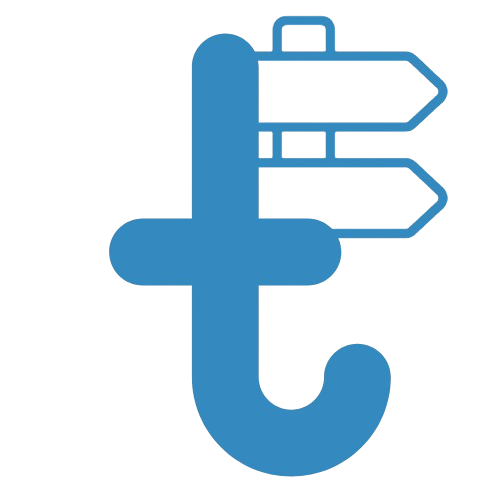
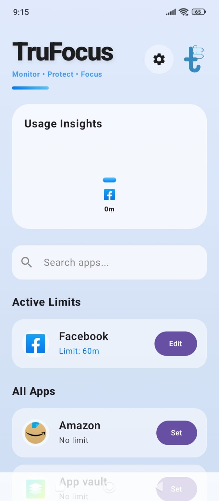
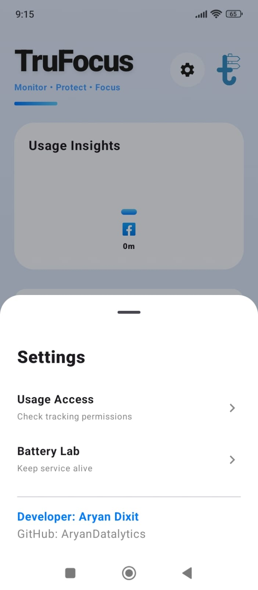
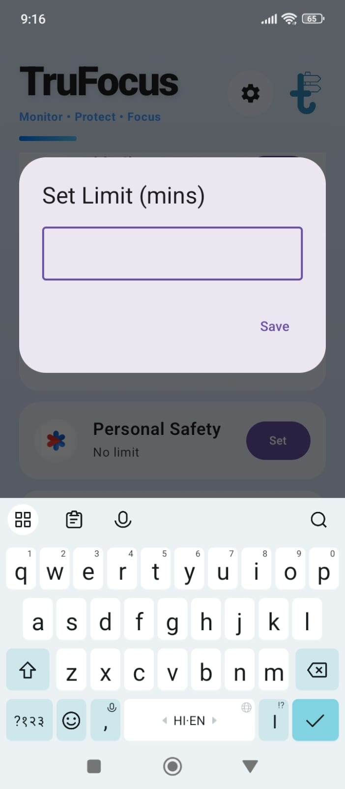
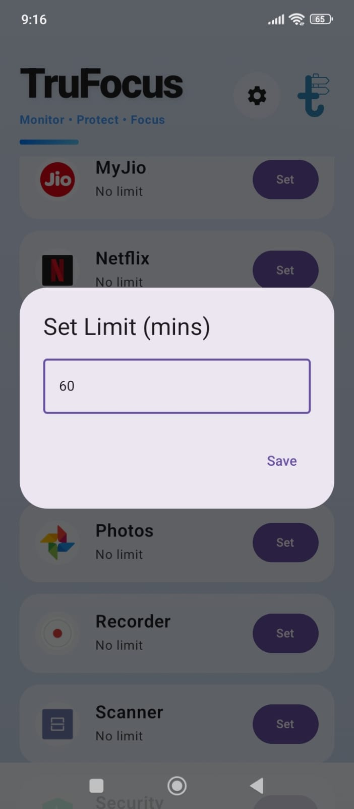
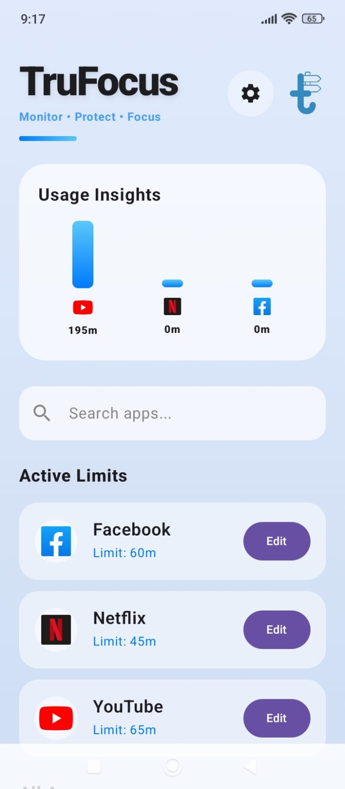

# TruFocus---for-Android-Usage-Limiter-App-
# TruFocus 📱

  

<h1 align="center">TruFocus</h1>

  <strong>Monitor • Protect • Focus</strong> 
  An Android application built with Jetpack Compose to reclaim your digital focus.

---

**TruFocus** is a productivity-first Android application designed to help users reclaim their time. It features a high-end, **iPhone-inspired (iOS)** user interface and provides real-time tracking of app usage to curb digital addiction.

## ✨ Key Features
* **Advanced iOS Aesthetic:** Implemented Glassmorphism, Squircles (continuous corner curves), and the Apple-signature color palette for a premium feel.
* **Real-time Usage Tracking:** Leverages Android's `UsageStatsManager` to monitor foreground time for every installed app.
* **Smart App Discovery:** Automatically scans and lists all launchable applications with their native icons.
* **Custom Limits:** Allows users to set specific daily time goals for individual apps via an intuitive TimePicker.

## 🛠️ Technical Stack
* **Language:** Kotlin
* **UI Framework:** Jetpack Compose (Declarative UI)
* **Architecture:** Modern Android Architecture (MVVM-ready)
* **Theme:** Material 3 (Customized for iOS Design Guidelines)

## 🚧 Work in Progress
* **Background Blocker Service:** Developing a persistent service to automatically overlay a block screen when limits are exceeded.
* **Statistics Dashboard:** Visualizing weekly usage trends with aesthetic charts.

## 📸 Preview
## 📱 App Previews

<table style="width: 100%; text-align: center;">
  <tr>
    <td> <b>Splash Screen</b></td>
    <td> <b>Dashboard</b></td>
    <td> <b>App Limits</b></td>
  </tr>
  <tr>
    <td> <b>Analytics</b></td>
    <td> <b>Focus Mode</b></td>
    <td> <b>Ready to Use</b></td>
  </tr>
</table>

---

